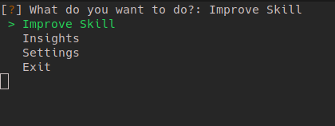

# LvlUp

current version: 1.0

## About

This program tracks the time invested into certain skills.  You can specify any skill and enter progress made on a daily basis. There is a simple Level algorithm to determine a level and give some gameification to your progress.

## Screenshots of the programm
### Main Menu

### Time input

### Level Summary

### Insight Menu

### Stats Display

### Graph Dispay

### Settings Menu

### Help Display

## Level Algorithm

The level algorithm is very simple. To reach a given level you have to complete n hours, where n is the number of the next level squared.

*Examples*:
- 1 hour to reach level 1 (1 ** 2 = 1);
- 4 hour to reach level 1 (2 ** 2 = 4);
- 9 hour to reach level 1 (3 ** 2 = 9);

and so on.

After reaching a level the number of hours (called experience, or EX for short) is reset. Meaning the 1 hour for level 1 does not count into the 4 hours of level 2. To reach level 2 you have to complete 4 whole hours more.

## Keeping Data

In the background there is a sqlite3 database, managed by sqlalchemy, with two tables/models:

1. *Entry*: This model stores all entries. Colums:
- *date* == a datetime object for the day of entry
- *minutes* == total minutes invested in a skill in a given day
- *skill* == Skillname, which also serves as as a foreign key to the *Skill* table
2. *Skill*: Provides an overview of all skills. Columns:
- *name* == Name of the skill
- *current_level* == Integer of the level of the user in the skill
- *total_minutes* == Accumulated minutes for a given skill
- *xp_points* == Current xp in the level, allows calculation of xp required to reach the next level
- *daily_goal* == The number of minutes that you plan to invest in every day

## Requirements

* [inquirer](https://magmax.org/python-inquirer/)
* [sqlalchemy](https://docs.sqlalchemy.org/en/13/)
* [matplotlib](https://matplotlib.org/)

The requirements are stored in requirements.txt and can be easily installed with the following command:
> pip install -r /path/to/requirements.txt

OR:
> pip3 install -r /path/to/requirements.txt

## Patch notes
*v 1.0* 
- Cleaned up code with comments
- Added pictures to the readme.md

*v 0.9.1*
- New feature: Delete Skill
  - Settings now support to delete a skill. Be careful with this one. There is no return
- New feature: Create backup
  - Settings allows to createa backup of your database
  - Naming convention: "backup-YYYY-MM-DD.db"
  - Stored in the ./db/ folder 
  
*v 0.9.0*
- New feature: Daily Goal
  - go into the settings and set a daily goal for a skill
  - see the daily goal line in your graphs
  - stats show how many times a week/month you have reached the daily goal
- housekeeping:
  - rearranged some code to be even more readable
  - new file: output.py for everthing that gets printed to the console

*v 0.8.5*
- Reworked menu flow
  - Program now runs in an infinite loop until it is exited
  - Settings and Insights now easily accessible
  - WARNING: not all menu options are ready to use yet, but basic functions like entering a new skill, tracking progress and showing graphs ought to work.

*v 0.8.4*
- Reworking graphs to show multiple skills with one line each
- Slight changes in the backend to make the former possible

*v 0.8.3*
Reworked backend with the functions split into multiple files
- levelup.py == the main script for tying everything together
- models.py == houses everything to do with the database
- menues.py == menu structure with inquirer
- graphs.py == graphs with matplotlib
- Also further improved the stats display for all skills and current skill, showing a comparison between the averages of the last week with the last month

*v 0.8.2*
implemented further stats for skills, such as comparison to last week and last month

*v 0.8.1*
fixed bug for new skills with 0 days implementation.
Implemented combined graphs for all skills.
Reworked closing menu.

*v 0.8.0*
implement SQLAlchemy as a SQL wrapper for the database.

*v 0.7.0:*
changed the whole background architecture from an xlxs sheet to a SQL database. Also, some minor improvments for user experience, such as fitting the outputscreen to the current terminal width.

*v 0.6.3:*
fixed a bug where program would crash if there was an invalid character in the skill name entered
updated the 'most recent progress' chart to actually only show the seven latest entries

*v 0.6.2:*
Cleaning up the modules (main, processing, print_output)
Let the user specify hours already invested in a certain skill, fill in other fields accordingly

*v 0.6.1: fixed some bugs*
Eliminate the hardcoded filepaths and replace with a config text file
Don't write a new daytime object if the entered amount is 0

*v 0.6.0:* added support for matplotlib and 2 simple graphing functions:
Hours invested per day
Progress over time

*version 0.5:* added support for multiple skills to levelup

## Upcoming features

* Implement further graphs to visualize characteristics
* Let the user specify a time goal for a skill on a weekly basis and graph the expected improvement versus the actual improvement

## Copyrights and contact info

There are no copyrights for this project. Do with the code whatever you please. The creator believes in self-ownership, just property rights, the resulting freedom of speech and the non-existence of intellectual property.
If you like the project and/or have ideas for further features, you can contact me at: alexanarcho@protonmail.com
